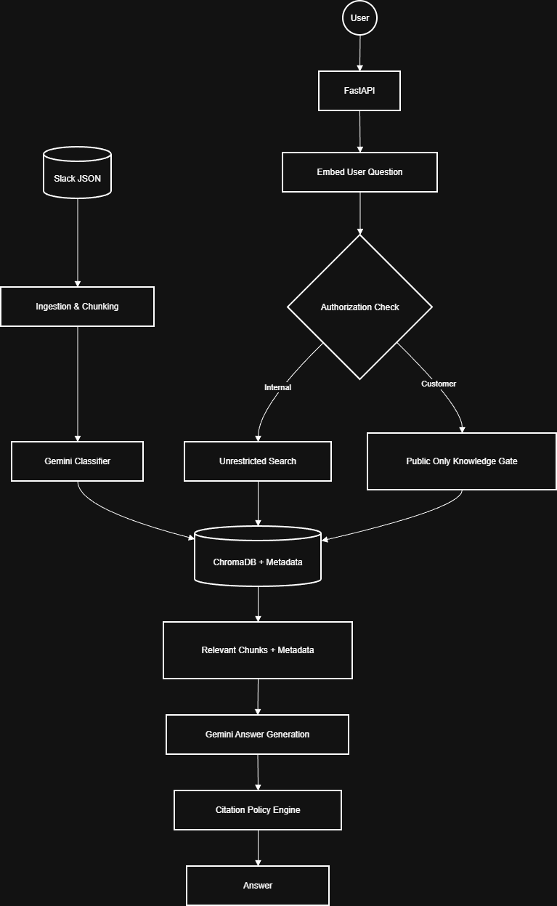

# Internal-Knowledge-to-Customer-Safe-AI-Assistant

This is an RAG system that does the following:
- Ingests internal Slack conversations.
- Classifies them using AI to find source of truth and customer safe data.
- Store embeddings in a vector database.
- Answer questions in internal and customer safe modes with citations.

## Architecture Overview

## Setup:
- Create a `.env` in the root directory and enter your google api key (`GEMINI_API_KEY=<your api key>`).
- [Create a virtual environment if needed.](https://packaging.python.org/en/latest/guides/installing-using-pip-and-virtual-environments/)
- Install the required dependencies from the `requirements.txt` file: `pip install -r requirements.txt`
- The project uses a central controller `main.py` to manage all of the tasks.
    - **Initial Setup (Ingest & Index):** `python main.py --setup`
    - **Start the REST API:** `python main.py --api`
    - **Query (Internal):** `python main.py --query "What is the API rate limit?"`
    - **Query (Customer Mode):** `python main.py --query "What is the API rate limit?" --customer`

## Key Definitions:

1. **Source of truth:** 
    - This is defined as a conversation chunk which represents a final and authoritative statement like a decision, policy, confirmed fix or explicit update which overrides any earlier discussion.
    - Each thread aware chunk is classified using an LLM and the model is prompted to decide if it's a source of truth, customer safe etc, using a boolean flag. 
    - The flag is later used during retrieval.
    - During question answering, chunks marked as source_of_truth are prioritized over discussion level context.
2. **Knowledge Worth Indexing:**
    - The system uses a Gemini powered classifier to filter data before it enters the vector database. Information that provides long term value only are indexed.
    - Brainstorming sessions, opinions, internal complaints or speculation are ignored.
3. **Customer Citation Policy:**
    -  **Internal mode:**
        - Retrieves all relevant chunks regardless of sensitivity.
        - Citations include full internal metadata such as Slack channel and thread ID.
        - Intended for internal employees.
    -  **Customer mode:**
        - Applies a strict retrieval filter: only chunks with `customer_safe == True` are eligible.
        - Citations are masked as generic public sources (example “Official Support Channel”).
        - If no customer-safe chunks are available, the system responds with “Insufficient public documentation available.”

## Tradeoffs

1. A lot of trust is put in the AI to get things right the very first time it reads the data. Since the AI decides what’s "internal" and what’s "customer-safe" right at the start, that label is stuck. 

2. Care was taken to minimize repeated calls to the Gemini API during the retrieval phase. Despite this optimization, the system’s scale is still bottlenecked by Gemini's rate limits during the initial bulk classification and final answer generation.

## Next Steps:

1. Currently, the system processes static JSON files. In the future, we can implement a workflow to automatically classify and index new messages as they are posted.

2. UI for admin-side to review AI classified chunks which would allow humans to manually approve or edit Source of Truth and Customer Safe flags.